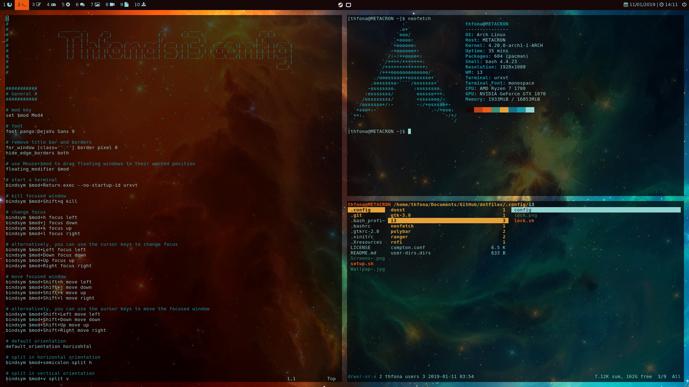

# Thfona's Arch Linux Rice

These are the dotfiles for my Arch Linux rice.
It's a pretty simple rice but I'm satisfied with the result.

## Stuff that I use:

+ i3-gaps
+ i3-lock
+ Polybar
+ Urxvt
+ Compton
+ Rofi
+ Pywal
+ Firefox
+ Vim
+ Visual Studio Code
+ Nautilus
+ Discord
+ Gimp
+ Feh
+ Mirage
+ Libre Office
+ Evince
+ Transmission
+ Network Manager / Network Manager Applet
+ Pulseaudio / Pavucontrol
+ LxAppearance
+ Galculator
+ Cmus
+ Cava
+ Scrot
+ Neofetch
+ Doge
+ Cmatrix
+ Htop
+ DejaVu Font
+ Font Awesome
